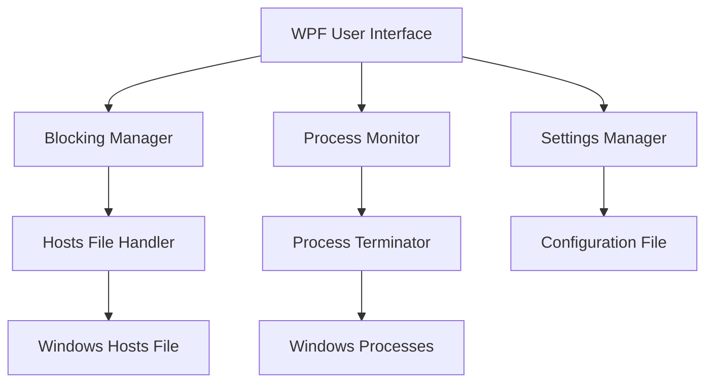

# Design Document

## Overview

The Laser Focus (lsrfcs) productivity app is a WPF desktop application that implements system-wide website blocking through Windows hosts file manipulation and application control through process monitoring and termination. The application follows a simple code-behind pattern with data binding for real-time UI updates.

## Architecture

### High-Level Architecture



### Core Components

1. **MainWindow (UI Layer)**

   - WPF window with XAML layout
   - Data binding to ObservableCollections
   - Event handlers for user interactions

2. **Website Blocking System**

   - Hosts file manipulation for DNS redirection
   - Website validation and formatting
   - Persistent storage of blocked sites

3. **Process Monitoring System**

   - Real-time process enumeration
   - Process filtering and classification
   - Automatic process termination

4. **Configuration Management**
   - Allowed applications list
   - Blocked websites persistence
   - Application settings

## Components and Interfaces

### MainWindow Class

**Responsibilities:**

- UI event handling
- Data binding management
- Timer coordination
- User feedback display

**Key Properties:**

- `ObservableCollection<string> blockedWebsites`
- `ObservableCollection<ProcessInfo> runningProcesses`
- `DispatcherTimer processTimer`
- `string[] allowedProcesses`

**Key Methods:**

- `AddWebsiteButton_Click()` - Adds website to block list
- `RemoveWebsiteButton_Click()` - Removes website from block list
- `StartButton_Click()` - Activates monitoring
- `StopButton_Click()` - Deactivates monitoring
- `ProcessTimer_Tick()` - Periodic process checking

### Website Blocking Component

**HostsFileManager Class (to be implemented)**

```csharp
public class HostsFileManager
{
    private readonly string hostsFilePath;

    public void BlockWebsite(string website)
    public void UnblockWebsite(string website)
    public bool IsWebsiteBlocked(string website)
    private string FormatWebsiteUrl(string website)
    private void ValidateAdminPrivileges()
}
```

**Responsibilities:**

- Hosts file read/write operations
- Website URL validation and formatting
- Administrator privilege checking
- Backup and restore functionality

### Process Monitoring Component

**ProcessMonitor Class (to be implemented)**

```csharp
public class ProcessMonitor
{
    private readonly string[] allowedProcesses;

    public List<ProcessInfo> GetRunningProcesses()
    public void TerminateProcess(int processId)
    public bool IsProcessAllowed(string processName)
    private bool IsUserProcess(Process process)
    private void LogProcessAction(string action, string processName)
}
```

**Responsibilities:**

- Process enumeration and filtering
- Process termination with error handling
- User process identification
- Process action logging

### Configuration Management

**ConfigurationManager Class (to be implemented)**

```csharp
public class ConfigurationManager
{
    public List<string> LoadBlockedWebsites()
    public void SaveBlockedWebsites(List<string> websites)
    public List<string> LoadAllowedApplications()
    public void SaveAllowedApplications(List<string> applications)
    public AppSettings LoadSettings()
    public void SaveSettings(AppSettings settings)
}
```

**Responsibilities:**

- Persistent storage of configuration
- JSON/XML serialization
- Default configuration management
- Settings validation

## Data Models

### ProcessInfo Class

```csharp
public class ProcessInfo : INotifyPropertyChanged
{
    public string ProcessName { get; set; }
    public int Id { get; set; }
    public string Status { get; set; }
    public Brush StatusColor { get; set; }
    public DateTime LastSeen { get; set; }

    public event PropertyChangedEventHandler PropertyChanged;
}
```

### AppSettings Class

```csharp
public class AppSettings
{
    public List<string> BlockedWebsites { get; set; }
    public List<string> AllowedApplications { get; set; }
    public int MonitoringInterval { get; set; } = 2000; // milliseconds
    public bool StartMinimized { get; set; }
    public bool ShowNotifications { get; set; }
}
```

### BlockedWebsite Class

```csharp
public class BlockedWebsite
{
    public string Url { get; set; }
    public DateTime DateBlocked { get; set; }
    public bool IsActive { get; set; }
}
```

## Error Handling

### Administrator Privileges

- Check privileges on startup
- Display clear error messages for insufficient permissions
- Graceful degradation when elevation is unavailable
- Retry mechanisms for privilege-dependent operations

### File System Operations

- Exception handling for hosts file access
- Backup creation before modifications
- Rollback capability on failure
- File locking detection and resolution

### Process Operations

- Handle access denied exceptions for system processes
- Graceful handling of already-terminated processes
- Logging of failed termination attempts
- Protection against terminating critical system processes

### Network and DNS

- Validation of website URLs
- Handling of malformed input
- DNS cache flushing after hosts file changes
- Network connectivity checks

## Testing Strategy

### Unit Testing

- **HostsFileManager**: Mock file system operations
- **ProcessMonitor**: Mock process enumeration
- **ConfigurationManager**: Test serialization/deserialization
- **Data Models**: Property change notifications

### Integration Testing

- **Website Blocking**: End-to-end blocking verification
- **Process Termination**: Safe process lifecycle testing
- **Configuration Persistence**: File system integration
- **UI Data Binding**: ObservableCollection updates

### System Testing

- **Administrator Privileges**: Elevation testing
- **Cross-Browser Blocking**: Chrome, Firefox, Edge verification
- **Process Monitoring**: Real application termination
- **Performance**: Memory usage and CPU impact

### Security Testing

- **Privilege Escalation**: Proper UAC handling
- **File System Security**: Hosts file protection
- **Process Security**: Prevention of system process termination
- **Input Validation**: Malicious URL handling

## Performance Considerations

### Memory Management

- Efficient ObservableCollection updates
- Process object disposal
- Timer resource cleanup
- UI thread optimization

### CPU Usage

- Optimized process enumeration frequency
- Selective process filtering
- Minimal UI updates
- Background thread utilization

### File I/O Optimization

- Batch hosts file operations
- Configuration caching
- Minimal file system access
- Asynchronous operations where appropriate

## Security Considerations

### Privilege Management

- Minimal required privileges
- Secure privilege checking
- Protected configuration storage
- Audit trail for administrative actions

### System Protection

- Whitelist-based process filtering
- Protection of critical system processes
- Safe hosts file manipulation
- Rollback mechanisms for system changes
